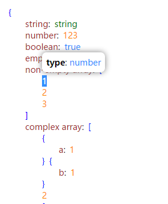
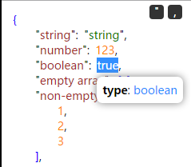

JSON Formatter
===

This is a userscript for browsers to display JSON data beautifully.

Features
---
1. Indented
1. Syntax highlighted
1. Show details with a click

Installation
---
First of all make sure a modern browser and the corresponding add-on are installed.

* Opera + Violentmonkey
* Maxthon + Violentmonkey
* Chrome + Violentmonkey / Tampermonkey
* Firefox + Greasemonkey

Then install the script from:

* 我的网站（中文）: <http://gerald.top/code/json-formatter>
* Greasy Fork: <https://greasyfork.org/scripts/10718>

Snapshots
---

